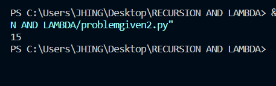

#  **RECURSION AND LAMBDA IN PYTHON**

BY: **CHARLS CAYABYAB**

:snake: 
:snake: 

SUBJECT: **COMPUTER PROGRAMMING 2**

# **RECURSION**

**Recursion** is a common mathematical and programming concept. It means that a function calls itself. This has the benefit of meaning that you can loop through data to reach a result.
The developer should be very careful with recursion as it can be quite easy to slip into writing a function which never terminates, or one that uses excess amounts of memory or processor power. However, when written correctly recursion can be a very efficient and mathematically-elegant approach to programming.

# **LAMBDA** 

A **lambda function** is a small anonymous function.
A lambda function can take any number of arguments, but can only have one expression.

**Why Use lambda Function**

The power of lambda is better shown when you use them as an anonymous function inside another function.

# **RELATIONS OF RECURSION AND LAMBDA IN PYTHON**

**Recursion** and lambda are both concepts in computer science and programming, and they can be related in several ways.
Recursion is a programming technique where a function calls itself. 

This can be a useful way to solve problems that can be broken down into smaller sub-problems that are similar in nature. Recursive functions often have a base case that stops the recursion from continuing indefinitely.

**Lambda**, also known as anonymous function, is a way to create functions on the fly without defining them explicitly. In some programming languages, lambda functions can be used as arguments to other functions or can be returned as results from functions.

# **GIVEN PROBLEM AND SOLUTION**

In this picture The **recursive_sum()** function takes a list of numbers as input and recursively calculates their sum using a lambda function.

In the base case, when the length of the input list is 1, the function returns the only element in the list, which is the sum of a single number.

In the recursive case, the function applies a lambda function to the input list. The lambda function takes the first element of the list x[0] and adds it to the result of recursively calling recursive_sum() on the remaining elements of the list x[1:]. 

The **lambda function** essentially breaks down the list into its first element and the remaining elements, and adds the first element to the sum of the remaining elements, which is computed by the recursive call. This process continues until the length of the input list reduces to 1, which is the base case.

When the function is called with the input [1, 2, 3, 4, 5], the following recursive steps are executed:

**1.The length of the input list is greater than 1, so the function enters the recursive case.**

**2.The lambda function adds the first element of the list 1 to the result of calling recursive_sum() on the remaining elements of the list [2, 3, 4, 5].**

**3.The function is called again with the input [2, 3, 4, 5].**

**4.The lambda function adds the first element of the list 2 to the result of calling recursive_sum() on the remaining elements of the list [3, 4, 5].**

**5.The function is called again with the input [3, 4, 5].**

**6.The lambda function adds the first element of the list 3 to the result of calling recursive_sum() on the remaining elements of the list [4, 5].**

**7.The function is called again with the input [4, 5].**

**8.The lambda function adds the first element of the list 4 to the result of calling recursive_sum() on the remaining elements of the list [5].**

**9.The length of the input list is 1, so the function returns 5.**

**10.The lambda function adds 4 and 5, which results in 9.**

**11.The lambda function in step 6 adds 3 and 9, which results in 12.**

**12.The lambda function in step 4 adds 2 and 12, which results in 14.**

**13.The lambda function in step 2 adds 1 and 14, which results in 15.**

**14.The final result of the function call is 15.**

